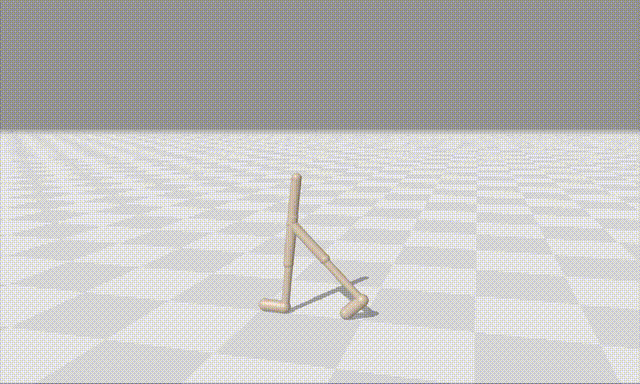
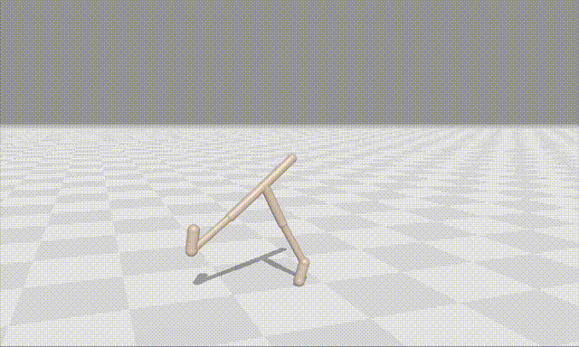

# aurora-xcon

<table>
  <tr>
    <td align="center">
      <br/>
      <strong>AURORA-XCon</strong>
    </td>
    <td align="center">
      <br/>
      <strong>AURORA</strong>
    </td>
  </tr>
</table>

This repository contains the code for *"Overcoming Deceptiveness in Fitness Optimization with Unsupervised Quality-Diversity"*. **AURORA-XCon** is an optimization algorithm that discovers high-performing solutions using **unsupervised quality-diversity**. It builds on the AURORA framework and introduces two key features: 1) **contrastive learning** and 2) **extinction events**.

<p align="center">
  
</p>

<p align="center"><strong>Figure 1:</strong> Overview of AURORA-XCon</p>

**Authors**: [Lisa Coiffard](https://scholar.google.com/citations?user=VBpD7AIAAAAJ&hl=en), [Paul Templier](https://scholar.google.com/citations?hl=en&user=lPrCGzYAAAAJ), [Antoine Cully](https://scholar.google.com/citations?user=rZtJlPQAAAAJ&hl=en&oi=sra)

**Paper** (GECCO 2025): *coming soon*

**Paper** (arxiv): https://arxiv.org/abs/2504.01915

---

## 🔧 Installation

```bash
git clone https://github.com/LisaCoiffard/aurora-xcon.git && cd aurora-xcon
```

### Using a virtual environment

```bash
python -m venv .venv
source .venv/bin/activate
pip install -r requirements.txt
```

### Using a container

Building the container:
```bash
apptainer build \
    --fakeroot \
    --force \
    --warn-unused-build-args \
    apptainer/container.sif apptainer/container.def
```

Shelling into the container:
```bash
apptainer shell \
    --bind $(pwd):/workspace/src/ \
    --cleanenv \
    --containall \
    --home /tmp/ \
    --no-home \
    --nv \
    --pwd /workspace/src/ \
    --workdir apptainer/ \
    apptainer/container.sif
```

---

## 🚀 Usage

### Launching Experiments

All experiments in the paper can be run with default configurations by executing the following command:
```bash
python -m main main <algo> env=<environment> seed=$RANDOM
```
where `<algo>` can be replaced with your chosen algorithm and `<environment>` with your chosen task. Supported environments are: `kheperax`, `brax/walker`, `brax/half_cheetah` and `brax/ant_maze`. Hyperparameters are provided in `configs/` and can be overriden via the command line. 

To replicate paper baselines you can choose from the following algorithms:
- `ga` for genetic algorithm
- `td3` for TD3
- `me` for MAP-Elites
- `pga_me` for PGA-MAP-Elites
- `jedi` for JEDi
- `aurora` for AURORA (all variants)
- `pga_aurora` for PGA-AURORA (all variants)

To run `aurora` or `pga-aurora` variants provide the following set of arguments:
- `loss_tye=mse` and `extinction=false` for (PGA-)AURORA
- `loss_type=mse` and `extinction=true` for (PGA-)AURORA-X
- `loss_type=triplet` and `extinction=false` for (PGA-)AURORA-Con
- `loss_type=triplet` and `extinction=true` for (PGA-)AURORA-XCon

### Reproducing Results

The `scripts/run_all_brax.sh` launches all experiments contained in the paper. 

### Example Notebooks

We provide two notebooks to help visualize and explore AURORA-XCon’s capabilities:

#### 🔍 `example_usage.ipynb`

This notebook walks through:
- Running a simple experiment using AURORA-XCon
- Loading and visualizing pre-trained repertoires from `example_repertoires/`
- Comparing the structure of latent spaces learned with reconstruction (`loss_type=mse`) vs. contrastive objectives (`loss_type=triplet`)

#### 🧠 `mnist_experiment.ipynb`

Located in the `mnist_exp/` directory, this notebook reproduces the MNIST experiment featured in the paper:
- Trains two autoencoders (MSE vs. Triplet loss) on digit images
- Visualizes and compares the resulting latent spaces

---

## 📖 Citation

*Coming Soon*

---

## 🙏 Acknowledgments

This work build upon:
- [Unsupervised Behavior Discovery With Quality-Diversity Optimization](https://ieeexplore.ieee.org/abstract/document/9736995) (AURORA)
- [QDax](https://github.com/adaptive-intelligent-robotics/QDax/tree/main)
